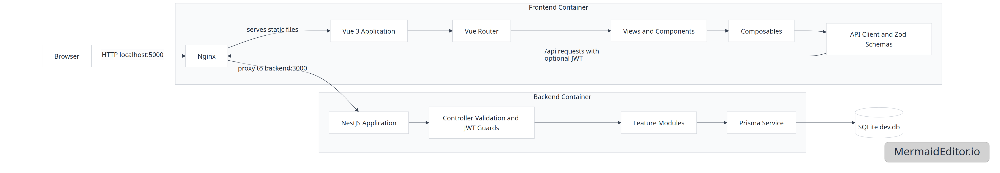

# Conduit

Conduit article application for Web Engineering 2.

## Team Members

| Full name | Matrikel-Nr. |
| --- | --- |
| Max Gebert | 21513 |

## Tech Stack

- TypeScript
- Node.js
- NestJS
- Vue 3
- Vue Router
- Vite
- Prisma
- SQLite
- Zod
- JWT
- Passport
- bcrypt
- Nginx
- Docker
- Docker Compose
- pnpm
- ESLint
- Prettier
- Jest

## Building Block View



## Run With Docker

The application can be started with a single Docker Compose command:

```bash
docker compose up
```

Then open the frontend:

```text
http://localhost:5000/
```

The backend API is available at:

```text
http://localhost:3000/api
```

The frontend container serves the Vue app and proxies `/api` requests to the backend container.

The current seeded SQLite database is included in the backend image as `dev.db`. Docker Compose provides the required backend environment variables itself, so the Docker setup does not depend on your local `.env` file.

## Run Locally Without Docker

Install dependencies:

```bash
pnpm install
```

Local development uses `.env` for backend configuration. The important values are:

```text
DATABASE_URL="file:./dev.db"
JWT_SECRET=conduit-local-development-secret
JWT_EXPIRES_IN=1d
```

Start the backend:

```bash
pnpm start:dev
```

Start the frontend in a second terminal:

```bash
pnpm frontend:dev
```

Open:

```text
http://localhost:5000/
```

## Seeded Test Users

All seeded users use the same password:

```text
password123
```

| Username | Email |
| --- | --- |
| mira | mira@conduit.test |
| jonas | jonas@conduit.test |
| lena | lena@conduit.test |
| samir | samir@conduit.test |

## Useful Commands

Build backend:

```bash
pnpm build
```

Build frontend:

```bash
pnpm frontend:build
```
